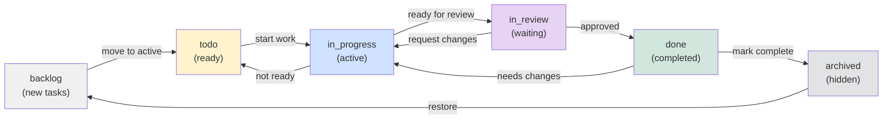

# Tasks Domain Context - TaskFlow

## Purpose

Tasks are the **atomic unit of work** in TaskFlow. Every project contains tasks, and every task is scoped to exactly one project. Tasks drive collaboration—team members assign tasks to each other, comment on them, attach files, and track progress through status changes.

Tasks are central to the TaskFlow experience:
- They bridge planning (project structure) with execution (daily work)
- They enable accountability (assignments, due dates, status)
- They facilitate collaboration (comments, @mentions, activity trails)
- They integrate with external systems (notifications, calendar sync, Slack)

---

## Key Entities

### Task Table

| Column | Type | Nullable | Default | Description |
|--------|------|----------|---------|-------------|
| `id` | UUID | No | gen_random_uuid() | Primary key |
| `project_id` | UUID | No | - | Foreign key to projects |
| `title` | VARCHAR(255) | No | - | Task name/title |
| `description` | TEXT | Yes | NULL | Markdown-formatted description |
| `status` | ENUM | No | 'backlog' | Current status in lifecycle |
| `priority` | ENUM | No | 'medium' | Priority level (low, medium, high, critical) |
| `assignee_id` | UUID | Yes | NULL | Assigned to user (can be unassigned) |
| `creator_id` | UUID | No | - | User who created the task |
| `due_date` | DATE | Yes | NULL | Expected completion date |
| `due_date_tz` | VARCHAR(50) | Yes | 'UTC' | Timezone for due date |
| `story_points` | INT | Yes | NULL | Agile estimation (1, 2, 3, 5, 8, 13) |
| `order` | FLOAT | No | - | Sort order within status (Figma-style ordering) |
| `labels` | UUID[] | Yes | '{}' | Tag IDs (array of foreign keys) |
| `parent_task_id` | UUID | Yes | NULL | For subtasks |
| `created_at` | TIMESTAMP | No | now() | Audit field |
| `updated_at` | TIMESTAMP | No | now() | Audit field |
| `archived_at` | TIMESTAMP | Yes | NULL | Soft delete timestamp |

**Constraints**:
- `UNIQUE(project_id, title)` - No duplicate titles per project
- `CHECK(status IN (...))` - Enum constraint
- `CHECK(priority IN (...))` - Enum constraint
- `FOREIGN KEY project_id REFERENCES projects(id) ON DELETE CASCADE`
- `FOREIGN KEY assignee_id REFERENCES users(id) ON DELETE SET NULL`
- `FOREIGN KEY creator_id REFERENCES users(id) ON DELETE RESTRICT`
- `FOREIGN KEY parent_task_id REFERENCES tasks(id) ON DELETE CASCADE`

**Indexes**:
```sql
CREATE INDEX idx_tasks_project_id ON tasks(project_id);
CREATE INDEX idx_tasks_assignee_id ON tasks(assignee_id);
CREATE INDEX idx_tasks_status ON tasks(status);
CREATE INDEX idx_tasks_due_date ON tasks(due_date) WHERE archived_at IS NULL;
CREATE INDEX idx_tasks_created_at ON tasks(created_at DESC);
```

---

## Business Rules

### Assignment Rules

1. **Assignee must be a project member**: A user can only be assigned if they're in `project_members` with role >= 'member'
2. **Assignee visibility**: Non-admin team members can only see tasks assigned to them or in projects they're members of
3. **Bulk reassignment**: Admins can reassign multiple tasks at once
4. **Unassignment allowed**: Tasks can have `assignee_id = NULL` (unassigned)

**Enforcement**: RLS policies in Supabase + Apollo Client validation

### Status Transition Rules

| From | Valid Transitions | Business Logic |
|------|-------------------|-----------------|
| `backlog` | → `todo` | Manual move to active work |
| `todo` | → `in_progress` | Start work |
| `in_progress` | → `in_review`, `todo` | Submit or move back to queue |
| `in_review` | → `done`, `in_progress` | Approve or request changes |
| `done` | → `archived`, `backlog` | Archive or reopen |
| `archived` | → `backlog` | Restore (soft delete) |

**Important**: Status changes can trigger side effects:
- Moving to `done` notifies assignee + creator
- Reverting from `done` re-notifies stakeholders
- Moving to `in_progress` triggers timer for SLA tracking

### Priority Inheritance

- If a task has a parent, child priority shouldn't exceed parent priority
- Example: Parent is `low` → children should be `low` or lower
- Enforced in mutations, not database constraint (soft rule)

### Comment Workflow

- Comments on tasks in `backlog` don't trigger notifications (too noisy)
- Comments on tasks in `done` or `archived` trigger email digest instead of instant notification
- @mentions always trigger instant notifications regardless of status

### Due Date Rules

- Due dates are stored as UTC DATE, but displayed in user's timezone
- Past due dates trigger hourly reminder emails (5 days before → 1 day after due)
- When reassigned, due date is inherited from original assignee (can be overridden)

---

## Status Lifecycle



**Status Semantics**:
- **backlog**: Unscheduled work, lowest priority
- **todo**: Scheduled but not started, waiting in queue
- **in_progress**: Currently being worked on by assignee
- **in_review**: Awaiting review/approval before done
- **done**: Completed, awaiting archival
- **archived**: Hidden from normal views, soft-deleted

---

## Code Locations

### Frontend

#### Types & Queries
```
src/features/tasks/types.ts              # Task, TaskStatus, TaskPriority, TaskFilters
src/features/tasks/queries.ts            # TASKS_QUERY, GET_TASK, SEARCH_TASKS
src/features/tasks/mutations.ts          # CREATE_TASK, UPDATE_TASK, DELETE_TASK, etc.
```

#### Components
```
src/features/tasks/components/
  ├── TaskCard.tsx                       # Compact task display
  ├── TaskDetailModal.tsx                # Full task view + edit
  ├── TaskForm.tsx                       # Create/edit form
  ├── TaskBoard.tsx                      # Kanban board (status columns)
  ├── TaskList.tsx                       # Table/list view
  ├── TaskFilters.tsx                    # Filter UI (status, priority, assignee, etc.)
  ├── TaskStatusBadge.tsx                # Status label with color
  ├── TaskPriorityIcon.tsx               # Priority indicator
  ├── TaskAssigneeAvatar.tsx             # Click to reassign
  ├── TaskDueDate.tsx                    # Due date display + edit
  ├── TaskLabels.tsx                     # Tag display + editor
  ├── TaskActionsMenu.tsx                # Archive, delete, bulk ops
  └── BulkTaskActions.tsx                # Multi-select toolbar
```

#### Pages
```
src/features/tasks/pages/
  ├── TasksPage.tsx                      # Main tasks view (routing between board/list/search)
  └── TaskDetailPage.tsx                 # Full-screen task detail (alt to modal)
```

#### Hooks
```
src/features/tasks/hooks/
  ├── useTask(taskId)                    # Single task fetch + refetch
  ├── useTaskList(projectId, filters)    # Paginated task list
  ├── useTaskCreate()                    # Create mutation
  ├── useTaskUpdate(taskId)              # Update mutation
  ├── useTaskDelete(taskId)              # Delete mutation
  ├── useAssignTask(taskId)              # Assignment mutation
  ├── useTaskFilters()                   # Filter state management
  ├── useTaskSearch(query)               # Full-text search
  ├── useTaskBulkOps()                   # Bulk update/delete
  ├── useTaskSubscription(taskId)        # Real-time updates via Supabase
  └── useTaskStatistics(projectId)       # Stats (counts by status, etc.)
```

### Backend

#### Database
```
supabase/migrations/
  ├── 20240101000000_create_tasks_table.sql
  ├── 20240102000000_add_task_indexes.sql
  ├── 20240103000000_add_task_rls.sql
  └── 20240104000000_add_task_labels.sql
```

#### RLS Policies
```
supabase/migrations/[date]_add_task_rls.sql

-- SELECT: See tasks in projects you're a member of
CREATE POLICY "users_see_project_tasks" ON tasks
  FOR SELECT USING (
    project_id IN (
      SELECT project_id FROM project_members
      WHERE user_id = auth.uid() AND deleted_at IS NULL
    )
  );

-- INSERT: Create tasks in projects you have at least 'member' role
CREATE POLICY "users_create_tasks" ON tasks
  FOR INSERT WITH CHECK (
    project_id IN (
      SELECT project_id FROM project_members
      WHERE user_id = auth.uid() AND role >= 'member'
    )
  );

-- UPDATE: Update tasks if you're admin or task assignee
CREATE POLICY "users_update_tasks" ON tasks
  FOR UPDATE USING (
    (assignee_id = auth.uid()) OR
    (
      project_id IN (
        SELECT project_id FROM project_members
        WHERE user_id = auth.uid() AND role >= 'admin'
      )
    )
  );

-- DELETE: Only admins can delete
CREATE POLICY "admins_delete_tasks" ON tasks
  FOR DELETE USING (
    project_id IN (
      SELECT project_id FROM project_members
      WHERE user_id = auth.uid() AND role = 'owner'
    )
  );
```

#### Server Functions
```
supabase/functions/
  ├── create_activity_log/
  │   └── index.ts                       # Logs task changes to activity_logs table
  ├── send_task_notification/
  │   └── index.ts                       # Email/in-app notification on assignment
  ├── process_task_mentions/
  │   └── index.ts                       # Parse comments for @mentions
  ├── bulk_update_tasks/
  │   └── index.ts                       # Server-side bulk operations
  └── calculate_task_stats/
      └── index.ts                       # Materialized view refresh
```

#### Database Triggers
```
-- Trigger: Update updated_at on any task change
CREATE TRIGGER update_tasks_updated_at
BEFORE UPDATE ON tasks
FOR EACH ROW
EXECUTE FUNCTION update_updated_at_column();

-- Trigger: Log task changes to activity table
CREATE TRIGGER log_task_changes
AFTER UPDATE ON tasks
FOR EACH ROW
WHEN (OLD.* IS DISTINCT FROM NEW.*)
EXECUTE FUNCTION log_activity('task', NEW.id);

-- Trigger: Notify assignee on assignment change
CREATE TRIGGER notify_on_assignment
AFTER UPDATE ON tasks
FOR EACH ROW
WHEN (OLD.assignee_id IS DISTINCT FROM NEW.assignee_id)
EXECUTE FUNCTION notify_on_task_assignment(NEW.id);
```

---

## GraphQL Operations

### Queries

#### GetTask (Single)
```graphql
query GetTask($id: UUID!) {
  task(id: $id) {
    id
    title
    description
    status
    priority
    assignee {
      id
      displayName
      avatar
    }
    creator {
      id
      displayName
    }
    project {
      id
      name
    }
    labels {
      id
      name
      color
    }
    dueDate
    dueDateTz
    storyPoints
    createdAt
    updatedAt
    archivedAt

    # Relations
    comments {
      edges {
        node {
          id
          content
          createdAt
          author { id displayName avatar }
        }
      }
      pageInfo {
        hasNextPage
        endCursor
      }
    }

    attachments {
      id
      filename
      url
      size
      createdAt
    }
  }
}
```

#### TaskCollection (List with Filters)
```graphql
query GetTasks(
  $projectId: UUID!
  $filter: TaskFilter
  $sort: TaskSort
  $after: String
) {
  tasks(
    projectId: $projectId
    filter: $filter
    sort: $sort
    after: $after
  ) {
    edges {
      node {
        id
        title
        status
        priority
        assignee { id displayName avatar }
        dueDate
        labels { id name color }
        storyPoints
        createdAt
        updatedAt
      }
      cursor
    }
    pageInfo {
      hasNextPage
      endCursor
      totalCount
    }
  }
}
```

**Filter Input**:
```graphql
input TaskFilter {
  status: [TaskStatus!]           # Enum: BACKLOG, TODO, IN_PROGRESS, etc.
  priority: [Priority!]           # Enum: LOW, MEDIUM, HIGH, CRITICAL
  assigneeIds: [UUID!]            # Multiple assignees
  creatorIds: [UUID!]
  labels: [UUID!]                 # AND condition
  dueDateRange: DateRange
  search: String                  # Full-text search in title + description
  archivedOnly: Boolean           # Include archived tasks
}

input DateRange {
  from: Date!
  to: Date!
}

enum TaskStatus {
  BACKLOG
  TODO
  IN_PROGRESS
  IN_REVIEW
  DONE
  ARCHIVED
}

enum Priority {
  LOW
  MEDIUM
  HIGH
  CRITICAL
}
```

#### SearchTasks (Full-text)
```graphql
query SearchTasks($projectId: UUID!, $query: String!) {
  searchTasks(projectId: $projectId, query: $query) {
    edges {
      node {
        id
        title
        status
        assignee { id displayName }
        matchScore
      }
    }
    totalCount
  }
}
```

### Mutations

#### CreateTask
```graphql
mutation CreateTask($input: CreateTaskInput!) {
  createTask(input: $input) {
    task {
      id
      title
      status
      priority
      assigneeId
      dueDate
      createdAt
    }
    success
    errors {
      field
      message
    }
  }
}

input CreateTaskInput {
  projectId: UUID!
  title: String!
  description: String
  priority: Priority
  assigneeId: UUID
  dueDate: Date
  storyPoints: Int
  labels: [UUID!]
}
```

#### UpdateTask
```graphql
mutation UpdateTask($id: UUID!, $input: UpdateTaskInput!) {
  updateTask(id: $id, input: $input) {
    task {
      id
      title
      status
      priority
      assigneeId
      updatedAt
    }
    success
    errors {
      field
      message
    }
  }
}

input UpdateTaskInput {
  title: String
  description: String
  status: TaskStatus
  priority: Priority
  assigneeId: UUID              # Can be null to unassign
  dueDate: Date
  storyPoints: Int
  labels: [UUID!]
}
```

#### AssignTask
```graphql
mutation AssignTask($id: UUID!, $assigneeId: UUID) {
  assignTask(id: $id, assigneeId: $assigneeId) {
    task {
      id
      assigneeId
      assignee { id displayName avatar }
      updatedAt
    }
    success
    error
  }
}
```

#### ChangeTaskStatus
```graphql
mutation ChangeTaskStatus($id: UUID!, $status: TaskStatus!) {
  changeTaskStatus(id: $id, status: $status) {
    task {
      id
      status
      updatedAt
    }
    success
    error
    validTransitions: [TaskStatus!]  # Return allowed next statuses
  }
}
```

#### DeleteTask
```graphql
mutation DeleteTask($id: UUID!) {
  deleteTask(id: $id) {
    success
    error
  }
}
```

#### BulkUpdateTasks
```graphql
mutation BulkUpdateTasks($projectId: UUID!, $taskIds: [UUID!]!, $update: BulkTaskUpdate!) {
  bulkUpdateTasks(projectId: $projectId, taskIds: $taskIds, update: $update) {
    updatedCount
    failedCount
    errors {
      taskId
      error
    }
  }
}

input BulkTaskUpdate {
  status: TaskStatus
  priority: Priority
  assigneeId: UUID
  labels: [UUID!]
}
```

#### ArchiveTask
```graphql
mutation ArchiveTask($id: UUID!) {
  archiveTask(id: $id) {
    task {
      id
      archivedAt
    }
    success
    error
  }
}
```

---

## RLS Policies (Detailed)

### SELECT Access

```sql
-- Policy 1: Users see tasks in projects they're members of
-- Checks project_members table for membership
CREATE POLICY "users_see_tasks_in_their_projects" ON tasks
  FOR SELECT
  USING (
    project_id IN (
      SELECT project_id
      FROM project_members
      WHERE user_id = auth.uid()
        AND deleted_at IS NULL
    )
  );
```

**Scope**: All read queries are governed by this policy
**Exception**: System admins (role = 'owner' at team level) can see all tasks

### INSERT Access

```sql
-- Policy 2: Users create tasks in projects where they're at least 'member'
CREATE POLICY "users_create_tasks" ON tasks
  FOR INSERT
  WITH CHECK (
    creator_id = auth.uid() AND
    project_id IN (
      SELECT project_id
      FROM project_members
      WHERE user_id = auth.uid()
        AND role >= 'member'
        AND deleted_at IS NULL
    )
  );
```

**Scope**: Prevents non-members from creating tasks
**Note**: `creator_id` is forced to `auth.uid()` server-side; can't spoof

### UPDATE Access

```sql
-- Policy 3: Users can update tasks if:
-- (a) They're the assignee, OR
-- (b) They're an admin (role = 'admin' or 'owner') in the project
CREATE POLICY "users_update_own_or_admin" ON tasks
  FOR UPDATE
  USING (
    assignee_id = auth.uid() OR
    project_id IN (
      SELECT project_id
      FROM project_members
      WHERE user_id = auth.uid()
        AND role IN ('admin', 'owner')
        AND deleted_at IS NULL
    )
  );
```

**Scope**: Assignees can update their tasks; admins can update any task
**Example**: Assignee can change status, add comment. Non-admin can't reassign.

### DELETE Access

```sql
-- Policy 4: Only project owners can delete tasks
CREATE POLICY "only_owners_delete_tasks" ON tasks
  FOR DELETE
  USING (
    project_id IN (
      SELECT project_id
      FROM project_members
      WHERE user_id = auth.uid()
        AND role = 'owner'
        AND deleted_at IS NULL
    )
  );
```

**Scope**: Soft deletes via `archived_at` are preferred; hard deletes are rare
**Audit**: All deletes logged to `activity_logs` table

---

## Dependencies

### Upstream Dependencies (Must exist first)

| Dependency | Relationship | Example |
|------------|--------------|---------|
| **Projects** | Every task belongs to exactly one project | `task.project_id → projects.id` |
| **Users** | Assignee and creator must exist | `task.assignee_id → users.id`, `task.creator_id → users.id` |
| **ProjectMembers** | Assignee must be project member | RLS checks `project_members` table |
| **Labels** | Task labels reference label records | `task.labels` array → `labels.id` |

**Cascade Behavior**:
- If project deleted → all tasks deleted (CASCADE)
- If user deleted → tasks with that `creator_id` fail (RESTRICT) - must reassign first
- If user deleted → `assignee_id` set to NULL (SET NULL)

### Downstream Dependencies (Depend on Tasks)

| Dependent | Relationship | Impact |
|-----------|--------------|--------|
| **Comments** | Tasks have many comments | Task deletion cascades |
| **Activity Logs** | Task changes trigger activity records | Audit trail |
| **Notifications** | Task changes trigger notifications | Assignment, status change |
| **Attachments** | Files attached to tasks | Task deletion cascades |
| **TaskLabels** | Join table for many-to-many | Task deletion cascades |
| **Subtasks** | Tasks can have parent tasks | Parent deletion cascades to children |
| **Webhooks** | External integrations listen to task events | Task events trigger webhooks |

**Triggering Side Effects**:
```typescript
// When task updated in frontend:
1. Update task in Apollo cache
2. Emit event: TaskUpdated
3. Backend triggers:
   - Log to activity_logs
   - Send notifications (if assignment changed)
   - Update materialized views (stats)
   - Trigger webhooks (to Slack, etc.)
```

---

## Common Gotchas

### Gotcha 1: Status Won't Transition

**Symptom**: User clicks "Mark Done" but status doesn't change. Apollo cache shows update, but backend rejected.

**Root Causes**:
- Assignee is null → only assignee can move to `in_progress`/`in_review`
- User isn't project admin → RLS policy rejects non-admin status changes
- Invalid status transition → moving from `done` to `todo` requires re-opening

**Debug**:
```typescript
// Check Apollo error
const [updateTask, { error }] = useMutation(UPDATE_TASK);
if (error?.networkError?.status === 403) {
  // RLS policy rejected (permission denied)
  toast.error('You cannot update this task');
}

// Check server logs
supabase.functions.logs(['task-update-logs'])
```

**Fix**:
```typescript
// Ensure user is assignee or admin before showing status button
if (task.assigneeId !== userId && !isAdmin) {
  return <button disabled>Only assignee can update</button>;
}
```

### Gotcha 2: Assignee Not Loading (Race Condition)

**Symptom**: Task card shows `assigneeId` but assignee name/avatar is missing.

**Root Cause**: Apollo cache miss. The `assignee` object wasn't fetched separately.

**Example**:
```graphql
// Bad: assigneeId is fetched, but not the assignee object
query GetTasks($projectId: UUID!) {
  tasks(projectId: $projectId) {
    edges {
      node {
        id
        title
        assigneeId            # Returns UUID
        # Missing: assignee { id displayName avatar }
      }
    }
  }
}

// Component tries to render:
<Avatar user={task.assignee} />  // assignee is undefined!
```

**Fix**:
```graphql
// Good: Always include assignee subfields
query GetTasks($projectId: UUID!) {
  tasks(projectId: $projectId) {
    edges {
      node {
        id
        title
        assigneeId
        assignee {               # Include this!
          id
          displayName
          avatar
        }
      }
    }
  }
}
```

### Gotcha 3: Due Date Timezone Issues

**Symptom**: Task due date shows as "Feb 10" but user sees "Feb 9" in their calendar.

**Root Cause**: Due date stored as UTC DATE but client renders in user's timezone without converting back.

**Example**:
```typescript
// Bad: DATE stored as UTC, rendered without timezone conversion
const dueDateStr = task.dueDate;  // "2024-02-10" (UTC)
return <div>{dueDateStr}</div>;    // Shows "Feb 10" but user is in PST (UTC-8)
```

**Fix**:
```typescript
// Good: Store timezone, convert on display
const dueDate = new Date(`${task.dueDate}T00:00:00Z`); // Parse as UTC
const formatter = new Intl.DateTimeFormat(locale, {
  timeZone: task.dueDateTz || 'UTC',
  year: 'numeric',
  month: 'short',
  day: 'numeric'
});
return <div>{formatter.format(dueDate)}</div>;
```

### Gotcha 4: Bulk Update Permissions

**Symptom**: Bulk action (reassign 10 tasks) succeeds for admin but fails for regular user.

**Root Cause**: RLS policy checks `UPDATE` permission per row. If user isn't assignee of all 10 tasks and isn't admin, bulk mutation fails.

**Example**:
```typescript
// Bad: Tries to bulk-update without checking permissions first
const { mutate: bulkUpdate } = useMutation(BULK_UPDATE_TASKS);
bulkUpdate({ taskIds: selectedTaskIds, update: { status: 'done' } });
// Fails if user isn't assignee of all selected tasks

// Good: Check permissions before showing bulk action
const canBulkUpdate = selectedTasks.every(
  task => task.assigneeId === userId || isAdmin
);

if (!canBulkUpdate) {
  return <button disabled>Cannot update some tasks</button>;
}
```

---

## Testing Considerations

### Key Flows to Test

1. **Task Lifecycle**
   - Create task → Move through statuses (backlog → todo → in_progress → in_review → done)
   - Verify notifications sent at each transition
   - Verify activity logged for each change

2. **Assignment & Permissions**
   - Only project members can be assigned
   - Assignee gets notifications
   - Non-assignees can't modify task (except admins)
   - Reassigning notifies old and new assignees

3. **Filtering & Search**
   - Filter by status returns correct subset
   - Filter by assignee returns only own tasks (or all if admin)
   - Full-text search finds tasks by title and description
   - Combining filters works (status AND priority)

4. **Bulk Operations**
   - Bulk reassign multiple tasks
   - Bulk status update checks permissions
   - Bulk operations are atomic (all succeed or all fail)
   - Activity logged for each bulk change

5. **Edge Cases**
   - Creating task with future due date
   - Archiving completed task
   - Reopening archived task
   - Deleting task with comments/attachments

### Mock Data Requirements

```typescript
// Mock task (for component testing)
const mockTask: Task = {
  id: 'task-1',
  projectId: 'project-1',
  title: 'Implement login flow',
  description: 'Add email/password authentication',
  status: 'in_progress',
  priority: 'high',
  assigneeId: 'user-1',
  creatorId: 'user-2',
  dueDate: '2024-02-15',
  dueDateTz: 'America/Los_Angeles',
  storyPoints: 5,
  labels: ['label-1', 'label-2'],
  createdAt: '2024-02-01T10:00:00Z',
  updatedAt: '2024-02-05T14:30:00Z',
  archivedAt: null,
};

// Mock user (assignee)
const mockAssignee: User = {
  id: 'user-1',
  displayName: 'Alice Chen',
  avatar: 'https://...',
};

// Mock comment for task detail view
const mockComments: Comment[] = [
  {
    id: 'comment-1',
    taskId: 'task-1',
    content: 'Started implementation',
    authorId: 'user-1',
    author: mockAssignee,
    createdAt: '2024-02-05T14:30:00Z',
  }
];
```

### RLS Testing

Test that RLS policies work correctly:

```typescript
// Test: Non-project member can't see task
const nonMemberClient = supabase.auth.signInAs('non-member@example.com');
const { error } = await nonMemberClient
  .from('tasks')
  .select('*')
  .eq('project_id', 'project-1');
expect(error?.code).toBe('PGRST301'); // No rows returned
```

---

## Recent Changes

| Date | Change | Author | Notes |
|------|--------|--------|-------|
| 2024-02-05 | Added `due_date_tz` field | Alice | Support user timezone display |
| 2024-01-28 | Implemented soft delete via `archived_at` | Bob | Replace hard deletes |
| 2024-01-15 | Added `order` field for custom sorting | Carol | Replace database order, use Figma-style |
| 2024-01-08 | Created RLS policies | David | Migrate from app-level auth checks |
| 2024-01-01 | Initial task schema | Eve | Backlog, todo, in_progress, done |

---

## Related Contexts

- **[Projects Domain](../projects/CONTEXT.md)**: Task container and owner
- **[Comments Domain](../comments/CONTEXT.md)**: Task collaboration
- **[Users Domain](../users/CONTEXT.md)**: Assignee and creator
- **[Notifications Domain](../notifications/CONTEXT.md)**: Task-triggered alerts
- **[Activity Domain](../activity/CONTEXT.md)**: Task change logs
- **[Root Context](../../AGENTS.md)**: Full system overview
