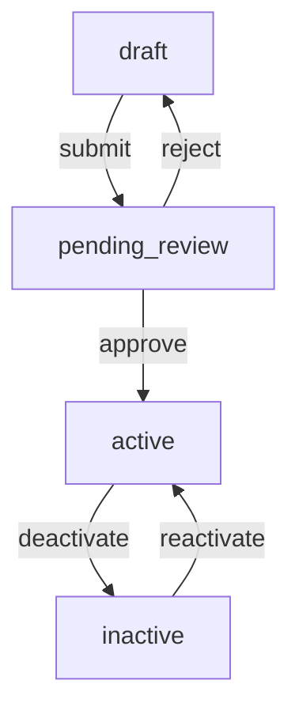

> **Type:** Domain
> **Focus:** [critical/high/medium/low]
> **Owner:** [@team-member]
> **Status:** [draft/active/deprecated]

# [DomainName] Domain

## Purpose

[One-sentence description of what this domain does and why it matters to the business]

---

## Key Entities

| Field | Type | Description | Required | Notes |
|-------|------|-------------|----------|-------|
| `[field1]` | `string` | [Description of what this field represents] | Yes | Primary identifier |
| `[field2]` | `uuid` | [Description of what this field represents] | Yes | Foreign key |
| `[field3]` | `timestamp` | [Description of what this field represents] | Yes | Auto-generated |
| `[field4]` | `json` | [Description of what this field represents] | No | Flexible schema |

---

## Business Rules

### [RuleName1]
- **Rule:** [Clear statement of the business requirement]
- **Implementation:** [How this is enforced in code - database constraint, trigger, GraphQL resolver, etc.]
- **Edge Cases:**
  - [Edge case 1 and how it's handled]
  - [Edge case 2 and how it's handled]
- **Related Tests:** [Link to test files or test descriptions]

### [RuleName2]
- **Rule:** [Clear statement of the business requirement]
- **Implementation:** [How this is enforced in code]
- **Edge Cases:**
  - [Edge case 1 and how it's handled]
- **Related Tests:** [Link to test files or test descriptions]

---

## Status Lifecycle

### State Diagram


### Status Definitions

| Status | Meaning | When It Occurs | Who Can Transition | Notes |
|--------|---------|----------------|-------------------|-------|
| `draft` | Initial state, not yet submitted | Created by system/user | Owner | Can be edited freely |
| `pending_review` | Awaiting approval | After user submits | Reviewer | Read-only to owner |
| `active` | Approved and in use | After approval | Reviewer/Admin | Standard state |
| `inactive` | No longer in use | After deactivation | Admin | Archived but retrievable |

### Status Transitions

| From | To | Trigger | Permissions | Implementation |
|------|----|---------|--------------|--------------------|
| `draft` | `pending_review` | User clicks "Submit" | Owner | Validation check in resolver + trigger |
| `pending_review` | `active` | Reviewer approves | Reviewer role | Update + notification trigger |
| `pending_review` | `draft` | Reviewer rejects | Reviewer role | Update + comment in rejection field |
| `active` | `inactive` | Admin deactivates | Admin role | Soft delete pattern or status flag |

---

## Code Locations

### Frontend

<!-- Adapt paths for your framework: Next.js uses app/ or pages/, React Native uses screens/, standard React uses src/ -->

| Layer | Type | Location(s) | Notes |
|-------|------|------------|-------|
| **Types** | TypeScript interfaces | `[src or types]/[DomainName].ts` | Main domain types |
| **Data Fetching** | Queries / hooks | `[src]/hooks/use[DomainName].ts` | Data fetching (GraphQL, REST, tRPC, etc.) |
| **Mutations** | Create/update/delete | `[src]/hooks/use[DomainName]Mutation.ts` | Mutation hooks or Server Actions |
| **Components** | React components | `[src]/components/[DomainName]/` | Domain-specific components |
| **Pages/Screens** | Route-level components | `app/[domain-name]/page.tsx` · `pages/[domain-name]/` · `screens/[DomainName]/` | Adapt to your router |
| **Hooks** | Custom hooks | `[src]/hooks/[domain-name]/` | Domain-specific hooks |

### Backend / API

<!-- Adapt to your backend: Supabase, Prisma, Drizzle, Firebase, custom API, etc. -->

| Layer | Type | Location(s) | Notes |
|-------|------|------------|-------|
| **Schema / Models** | Database | `prisma/schema.prisma` · `supabase/migrations/` · `src/db/schema.ts` | Adapt to your ORM/database |
| **Migrations** | Database | `prisma/migrations/` · `supabase/migrations/` · `drizzle/` | Migration files |
| **API Routes** | Endpoints | `app/api/[domain]/route.ts` · `pages/api/[domain].ts` · `src/routes/` | Server-side endpoints |
| **Access Control** | Security | RLS policies · middleware · auth guards | Row-level security, middleware, or custom auth |
| **Functions** | Serverless | `supabase/functions/` · `netlify/functions/` · `aws/lambda/` | Serverless or edge functions |
| **Resolvers** | API layer | `src/graphql/resolvers/` · `src/trpc/routers/` | If using GraphQL or tRPC |

---

## API Operations

<!-- Document your actual API operations. Use the section that matches your stack (GraphQL, REST, tRPC, Server Actions). Remove the others. -->

### GraphQL (if applicable)

```graphql
query Get[DomainName]ById($id: UUID!) {
  [entityName]_by_id(id: $id) { id, name, status }
}

mutation Create[DomainName]($input: Create[DomainName]Input!) {
  create[DomainName](input: $input) { id, name, status }
}
```

### REST Endpoints (if applicable)

| Method | Endpoint | Purpose | Auth Required |
|--------|----------|---------|---------------|
| `GET` | `/api/[domain]` | List all | Yes |
| `GET` | `/api/[domain]/:id` | Get by ID | Yes |
| `POST` | `/api/[domain]` | Create | Yes |
| `PUT` | `/api/[domain]/:id` | Update | Yes |
| `DELETE` | `/api/[domain]/:id` | Delete | Yes |

### tRPC / Server Actions (if applicable)

```typescript
// tRPC router
[domain]Router.query('[domain].getById', { ... })
[domain]Router.mutation('[domain].create', { ... })

// Next.js Server Actions
'use server'
export async function create[DomainName](formData: FormData) { ... }
```

---

## Access Control

### Access Control Matrix

| Role | Read | Create | Update | Delete | Notes |
|------|------|--------|--------|--------|-------|
| `authenticated` | Own records + shared | Own records | Own records | Own records | Standard user access |
| `admin` | All | All | All | All | Full access |
| `public` | Shared records | No | No | No | Read-only public data |
| `service` | All | All | All | All | Backend/cron access |

### Implementation

<!-- Document your actual access control implementation. Adapt to your backend: -->

**Supabase RLS** (if applicable):
```sql
CREATE POLICY "[DomainName]_access" ON [table_name]
  FOR SELECT USING (auth.uid() = created_by);
```

**Middleware** (if applicable):
```typescript
// Next.js middleware, Express middleware, or custom auth guards
export function authorize(req, res, next) { ... }
```

**Firebase Security Rules** (if applicable):
```
match /[collection]/{docId} {
  allow read: if request.auth != null;
}
```

---

## Dependencies

### Upstream Dependencies
- **Domain:** [RelatedDomain1] - [reason for dependency]
- **Domain:** [RelatedDomain2] - [reason for dependency]
- **External Service:** [ServiceName] - [reason for dependency]

### Downstream Dependencies
- **Domain:** [ConsumerDomain1] - [what data/service it consumes]
- **Feature:** [FeatureName] - [what it depends on]

---

## Common Gotchas

### [GotchaTitle1]
- **Symptom:** [What happens when you encounter this issue]
- **Cause:** [Why this happens]
- **Fix:** [How to resolve it]
- **Prevention:** [How to avoid it in the future]
- **Related Issue:** [Link to GitHub issue if applicable]

### [GotchaTitle2]
- **Symptom:** [What you observe]
- **Cause:** [Root cause]
- **Fix:** [Solution]
- **Prevention:** [Proactive measures]

---

## Testing Considerations

### Key Flows to Test
1. **[FlowName1]**
   - Create with valid data → verify creation
   - Update status → verify transitions
   - Delete → verify cleanup

2. **[FlowName2]**
   - Access control - own records
   - Access control - shared records
   - Access control - unauthorized access

### Edge Cases
- Empty/null values in optional fields
- Concurrent modifications (race conditions)
- Cascading deletions and data integrity
- Timezone handling in timestamps
- Large payload handling (if applicable)
- Pagination edge cases (limit=1, offset=0, no results)

### Mocks Required
- API responses (GraphQL, REST, tRPC, etc.)
- Database records with various status states
- User authentication contexts
- Related domain data dependencies

---

## Recent Changes

| Date | Change | PR/Commit | Status |
|------|--------|-----------|--------|
| YYYY-MM-DD | [Description of change] | [Link] | [merged/pending] |
| YYYY-MM-DD | [Description of change] | [Link] | [merged/pending] |
| YYYY-MM-DD | [Description of change] | [Link] | [merged/pending] |

---

## Related Documentation

- [Link to Architecture Document](./ARCHITECTURE.md)
- [Link to Related Workflow](./WORKFLOW.md)
- [Link to Related Pattern](./PATTERN.md)
- [Link to External Docs]()

---

*Created: YYYY-MM-DD*
*Last Updated: YYYY-MM-DD*
