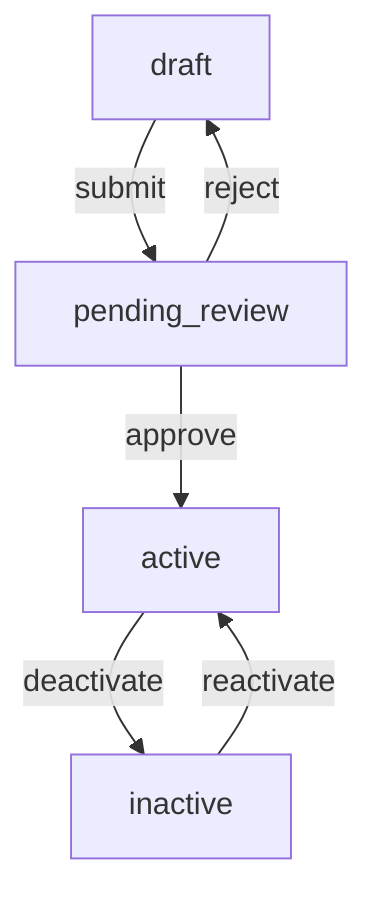

> **Type:** Domain
> **Focus:** [critical/high/medium/low]
> **Owner:** [@team-member]
> **Status:** [draft/active/deprecated]

# [DomainName] Domain

## Purpose

[One-sentence description of what this domain does and why it matters to the business]

---

## Key Entities

| Field | Type | Description | GraphQL Type |
|-------|------|-------------|--------------|
| `[field1]` | `string` | [Description of what this field represents] | `String!` |
| `[field2]` | `uuid` | [Description of what this field represents] | `UUID!` |
| `[field3]` | `timestamp` | [Description of what this field represents] | `DateTime!` |
| `[field4]` | `jsonb` | [Description of what this field represents] | `JSON` |

---

## Business Rules

### [RuleName1]
- **Rule:** [Clear statement of the business requirement]
- **Implementation:** [How this is enforced in code - database constraint, trigger, GraphQL resolver, etc.]
- **Edge Cases:**
  - [Edge case 1 and how it's handled]
  - [Edge case 2 and how it's handled]
- **Related Tests:** [Link to test files or test descriptions]

### [RuleName2]
- **Rule:** [Clear statement of the business requirement]
- **Implementation:** [How this is enforced in code]
- **Edge Cases:**
  - [Edge case 1 and how it's handled]
- **Related Tests:** [Link to test files or test descriptions]

---

## Status Lifecycle

### State Diagram


### Status Definitions

| Status | Meaning | When It Occurs | Who Can Transition | Notes |
|--------|---------|----------------|-------------------|-------|
| `draft` | Initial state, not yet submitted | Created by system/user | Owner | Can be edited freely |
| `pending_review` | Awaiting approval | After user submits | Reviewer | Read-only to owner |
| `active` | Approved and in use | After approval | Reviewer/Admin | Standard state |
| `inactive` | No longer in use | After deactivation | Admin | Archived but retrievable |

### Status Transitions

| From | To | Trigger | Permissions | Implementation |
|------|----|---------|--------------|--------------------|
| `draft` | `pending_review` | User clicks "Submit" | Owner | Validation check in resolver + trigger |
| `pending_review` | `active` | Reviewer approves | Reviewer role | Update + notification trigger |
| `pending_review` | `draft` | Reviewer rejects | Reviewer role | Update + comment in rejection field |
| `active` | `inactive` | Admin deactivates | Admin role | Soft delete pattern or status flag |

---

## Code Locations

### Frontend

| Layer | Type | Location(s) | Notes |
|-------|------|------------|-------|
| **Types** | TypeScript interfaces | `src/types/[DomainName].ts` | Main domain types |
| | | `src/types/[DomainName]Query.ts` | GraphQL query types |
| **Queries** | GraphQL queries | `src/graphql/queries/[DomainName].gql` | Data fetching queries |
| | | `src/hooks/use[DomainName]Query.ts` | React Query wrapper |
| **Mutations** | GraphQL mutations | `src/graphql/mutations/[DomainName].gql` | Create/update/delete |
| | | `src/hooks/use[DomainName]Mutation.ts` | React Query wrapper |
| **Components** | React components | `src/components/[DomainName]/` | Domain-specific components |
| **Pages** | Page components | `src/pages/[domain-name]/` | Routed pages |
| **Hooks** | Custom hooks | `src/hooks/[domain-name]/` | Domain-specific hooks |
| **Drawer** | Side panel UI | `src/components/drawers/[DomainName]Drawer.tsx` | Details/form drawer |

### Backend

| Layer | Type | Location(s) | Notes |
|-------|------|------------|-------|
| **Tables** | Database | `supabase/migrations/YYYYMMDD_create_[table_name].sql` | Primary entity table(s) |
| | | `supabase/migrations/YYYYMMDD_create_[relationship_table].sql` | Junction/relationship tables |
| **Constraints** | Database | Same migration files | PK, FK, UNIQUE, CHECK |
| **RLS** | Security | `supabase/migrations/YYYYMMDD_rls_[table_name].sql` | Row-level security policies |
| **Views** | Database | `supabase/migrations/YYYYMMDD_views_[name].sql` | Materialized views for denormalization |
| **Indexes** | Database | Same table migrations | BTREE, GIN, BRIN for performance |
| **Functions** | PL/pgSQL | `supabase/functions/[function_name].sql` | Domain-specific DB functions |
| **Triggers** | Database | `supabase/migrations/YYYYMMDD_triggers_[name].sql` | Automated enforcement |
| **GraphQL** | Configuration | `supabase/config.graphql` | Schema definitions |
| | | `supabase/resolvers/[domain-name].ts` | Custom resolvers |

---

## GraphQL Operations

### Example Query

```graphql
query Get[DomainName]ById($id: UUID!) {
  [entityName]_by_id(id: $id) {
    id
    name
    status
    created_at
    updated_at
    # Include relationships as needed
    [relationshipField] {
      id
      name
    }
  }
}
```

### Example Mutation

```graphql
mutation Create[DomainName]($input: Create[DomainName]Input!) {
  create[DomainName](input: $input) {
    id
    name
    status
    created_at
    # Return relevant fields
  }
}

input Create[DomainName]Input {
  name: String!
  description: String
  [customField]: [Type]
}
```

### Example Subscription (if applicable)

```graphql
subscription On[DomainName]Updated($id: UUID!) {
  [entityName]_updated(id: $id) {
    id
    name
    status
    updated_at
  }
}
```

---

## RLS Policies

### Access Control Matrix

| Role | Select | Insert | Update | Delete | Notes |
|------|--------|--------|--------|--------|-------|
| `authenticated` | Own records + shared | Own records | Own records | Own records | Standard user access |
| `admin` | All | All | All | All | Full access |
| `public` | Shared records | ❌ | ❌ | ❌ | Read-only public data |
| `service_role` | All | All | All | All | Backend/cron access |

### Access Pattern Example

```sql
-- Users can only access records they own or that are shared with them
CREATE POLICY "[DomainName]_access_policy" ON [table_name]
  FOR SELECT
  USING (
    auth.uid() = created_by
    OR EXISTS (
      SELECT 1 FROM [sharing_table]
      WHERE record_id = [table_name].id
      AND user_id = auth.uid()
    )
  );
```

---

## Dependencies

### Upstream Dependencies
- **Domain:** [RelatedDomain1] - [reason for dependency]
- **Domain:** [RelatedDomain2] - [reason for dependency]
- **External Service:** [ServiceName] - [reason for dependency]

### Downstream Dependencies
- **Domain:** [ConsumerDomain1] - [what data/service it consumes]
- **Feature:** [FeatureName] - [what it depends on]

---

## Common Gotchas

### [GotchaTitle1]
- **Symptom:** [What happens when you encounter this issue]
- **Cause:** [Why this happens]
- **Fix:** [How to resolve it]
- **Prevention:** [How to avoid it in the future]
- **Related Issue:** [Link to GitHub issue if applicable]

### [GotchaTitle2]
- **Symptom:** [What you observe]
- **Cause:** [Root cause]
- **Fix:** [Solution]
- **Prevention:** [Proactive measures]

---

## Testing Considerations

### Key Flows to Test
1. **[FlowName1]**
   - Create with valid data → verify creation
   - Update status → verify transitions
   - Delete → verify cleanup

2. **[FlowName2]**
   - Access control - own records
   - Access control - shared records
   - Access control - unauthorized access

### Edge Cases
- Empty/null values in optional fields
- Concurrent modifications (race conditions)
- Cascading deletions and data integrity
- Timezone handling in timestamps
- Large payload handling (if applicable)
- Pagination edge cases (limit=1, offset=0, no results)

### Mocks Required
- GraphQL query/mutation responses
- Database records with various status states
- User authentication contexts
- Related domain data dependencies

---

## Recent Changes

| Date | Change | PR/Commit | Status |
|------|--------|-----------|--------|
| YYYY-MM-DD | [Description of change] | [Link] | [merged/pending] |
| YYYY-MM-DD | [Description of change] | [Link] | [merged/pending] |
| YYYY-MM-DD | [Description of change] | [Link] | [merged/pending] |

---

## Related Documentation

- [Link to Architecture Document](./ARCHITECTURE.md)
- [Link to Related Workflow](./WORKFLOW.md)
- [Link to Related Pattern](./PATTERN.md)
- [Link to External Docs]()

---

*Created: YYYY-MM-DD*
*Last Updated: YYYY-MM-DD*
